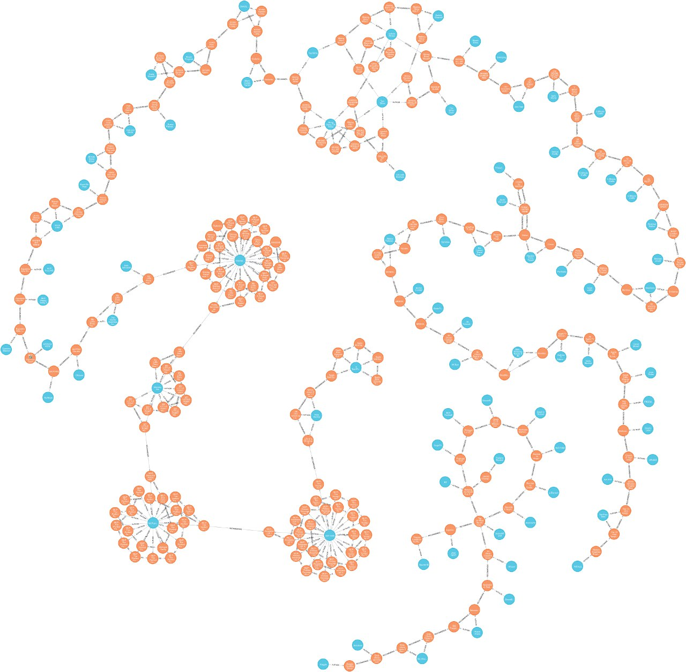

Do you ever wonder where youtube will take you if you watch 1000 videos in a row, or what happens if you press the **Next** button for a large number of times? Let say you start watching the trailer of *Spider-Man: Far From Home*, could we say anything particular about the 1000th video after this one? Is it going to be a Movie trailer or Music Video, or it will be a very different type of video, like a tutorial on Deep Learning?

## Just enough background

Recommendation Systems are a vast field of study and to be honest until recently, they hadn't aroused my interests. A couple of months ago, I watched [James Bridle's excellent TedTalk](https://www.youtube.com/watch?v=v9EKV2nSU8w), and after that, I started to pay attention to all sort of content I receive from any type of "Recommendation Systems!" and I realized how terrible they can be!  Guess I have to explain some examples:

I blocked someone on LinkedIn, but LinkedIn keeps emailing me about her. After liking some *Dua Lipa* related videos, My Instagram (explore) feed filled with materials generated by her fans. Youtube has some sort of grouping feature that sucks at unimaginable rate! One time it showed me a group named *Game of Thrones Topic* with some Marvel movies! I imagine Youtube did know I love Marvel universe, but I am not a fan of GOT! After watching *Avengers: Infinity War*, I looked into Quora to find some answers, ever since Quora keeps me updated about every question related to the entire Marvel Universe. This list goes on and on.





---

## Start asking questions

These issues made me think about Recommendation Systems. Where these problems came from? How much do people care about them? I certainly do! Before purposing any remedy let's start asking questions about current systems. I believe if we ask the right set of questions and define some metrics and calculate them, we may be able to fix things. For reducing the variance and scope of the research, I only focus on Youtube. So let's start asking some questions:

1. What is the expected length of a cycle/loop in Youtube's recommendation list?
1. How often you ended up seeing inappropriate content?
1. How much Content Deviation occurs after following *X* recommended videos?
1. How long does it take to Youtube forget about my search query *Q*?
1. Is a specific Video, Author (Youtuber) or Category reachable from a particular starting point?
1. Better Questions?

In the 3rd question, I tossed a term **Content Deviation** which by that I mean how does the content change over time. (let say we started with a video in *"sport"* category, after pressing Next button *X* times, which category we will be in?). These questions are relatively simple to answer, the only challenge we have to face for solving them is mining/extracting Youtube's recommendation graph. The harder problem one can think is to reverse engineer Youtube's recommendation algorithm.

## Grab Youtube

For extracting and Analyzing Youtube's Recommendation System, I use three things: Javascript, Puppeteer, and Neo4J. Puppeteer is a headless Chrome Node API, which helps me to navigate Youtube. Neo4J is my favorite graph database for storing extracted recommendation chains/graphs.

Here is my very first try to navigate through Youtube's video and extract some information. This is code is super slow, but it helped me to discover a few (cool) details about Youtube.

```javascript
const puppeteer = require('puppeteer');
const neo4j = require('neo4j-driver').v1;
const fetch = require("node-fetch");

const driver = neo4j.driver("bolt://localhost:7687", neo4j.auth.basic('neo4j', 'neo4jpassword'));
const session = driver.session();

function youtubeurl_to_json(url) {
    return "https://www.youtube.com/oembed?url=" + url + "&format=json";
}

// Inserts a video into Neo4J
function insert_to_neo4j(videoURL) {
    const jsonURL = youtubeurl_to_json(videoURL)

    // getting some meta-data about the video
    return fetch(jsonURL)
        .then(response => {
            if (response.ok) {
                return response.json()
            } else {
                return Promise.reject('something went wrong!')
            }
        })
        .then(data => {
            // A quick way to convert and insert JSON into Neo4J
            return session.run(
                `
          WITH $json AS video
          MERGE (v:VIDEO {title: video.title, thumbnail_url: video.thumbnail_url, url: $video_url})
          MERGE (a:AUTHOR {name: video.author_name, author_url: video.author_url})
          MERGE (a)-[:AUTHOR]->(v)
          RETURN v
      `, {
                    json: data,
                    video_url: videoURL
                }
            );
        })
        .then(() => {
            session.close();
            driver.close();
        })
        .catch(error => console.log('got an error: ', error))
}

// Creates a recommendation link between videos in Neo4J
function create_recommendation_link(sourecVideoURL, targetVideoURL) {
    return session.run(
        `MATCH (a:VIDEO {url: $video1})
     MATCH (b:VIDEO {url: $video2})
     MERGE (a)-[r:RECOMMENDS]->(b)
     RETURN a, b`, {
            video1: sourecVideoURL,
            video2: targetVideoURL
        }
    ).then(() => {
        session.close();
        driver.close();
    });
}

let ytWalker = async (initialVideoURL) => {
    // Prepare browser with proxy, Only if you can't access Youtube
    const browser = await puppeteer.launch({
        // args: [
        //   '--proxy-server=192.168.0.8:8123'
        // ]
    });

    const page = await browser.newPage();
    await page.goto(initialVideoURL, {
        waitUntil: 'domcontentloaded'
    });

    let lastVideoUrl = await page.url();
    let currentVideoUrl = await page.url();

    // number of pages to explore
    let chainCtr = 1000;

    while (chainCtr > 0) {
        // Puppeteer doesn't play nice with Youtube, and vice versa!
        // We need to check if the next page/video is loaded manually.

        // checking if the prev and current URLs are different!
        // this loop can run forever! As we may fail to find or click on a.ytp-next-button
        while (lastVideoUrl == currentVideoUrl) {
            await page.click('a.ytp-next-button');
            await page.waitFor(1000);
            currentVideoUrl = await page.url();
        }

        // Give some time to Youtube
        await page.waitFor(4999);

        const add_to_neo4j = async (video1, video2, chainId) => {
            await insert_to_neo4j(video1);
            await insert_to_neo4j(video2);
            await create_recommendation_link(video1, video2).then(() => {
                console.log(chainId + " - Chain Created!")
            })
        }

        add_to_neo4j(lastVideoUrl, currentVideoUrl, (1000 - chainCtr))

        lastVideoUrl = currentVideoUrl;
        chainCtr--
    }
    console.log("All Done!");
    await browser.close();
}
```

---

## Early results

My first discovery was how one could fall into the category of "Inappropriate Content" just by exploring videos on the first page of Youtube, even when you are not logged into your account! I started with "[*Ariana Grande - thank u, next*](https://www.youtube.com/watch?v=gl1aHhXnN1k)" video and after following less than 200  recommended videos, I found an interesting video. A video for kids and at the same time, Inappropriate for some audience! You can watch this video [Here](https://www.youtube.com/watch?v=-nAGgRIitXo).



For reaching any conclusion, we need more data and extracting these type of data requires some time. So I don't make any judgment until I gather enough data.

---

## Some nice visualization for you

I will conclude my first post in this blog with a beautiful graph visualization.

[  ](../assets/img/yt/simplewalk.jpg)

<p style="text-align: center;">
A super tiny visualization, <span style="color:orange">Orange</span> nodes are Videos, and  <span style="color:blue">Blue</span> ones are Youtubers.
</p>
